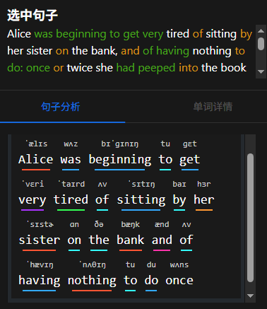

# 快速开始

本指南将帮助您快速设置并开始使用 ReadBridge 进行沉浸式语言学习。

## 安装

ReadBridge 提供多种安装方式，请根据您的需求选择最适合的方式。

### 网页应用

访问 [ReadBridge 官方网站](https://readbridge.cc)，无需安装即可立即开始使用。

### 桌面应用

从 [GitHub 发布页面](https://github.com/WindChimeEcho/read-bridge/releases) 下载适合您操作系统的安装包：

#### Windows

1. 下载 `.exe` 安装程序或 `.msi` 安装包
2. 双击运行安装程序
3. 按照安装向导的指示完成安装

#### macOS

1. 下载适合您处理器类型的 `.dmg` 文件（Intel 或 Apple Silicon）
2. 打开下载的文件
3. 将 ReadBridge 应用拖到应用程序文件夹中

#### Linux

根据您的发行版，下载并安装对应的软件包：
- 通用 Linux：下载 `.AppImage` 文件，添加执行权限后运行
- Debian/Ubuntu：下载 `.deb` 文件，使用 `dpkg -i` 命令安装
- RedHat/Fedora/CentOS：下载 `.rpm` 文件，使用包管理器安装

### 自行部署

如果您希望在自己的服务器上部署 ReadBridge，请参考 [GitHub 仓库的 README 文件](https://github.com/WindChimeEcho/read-bridge)，其中包含完整的部署指南和配置说明。

## 初始设置

首次启动 ReadBridge 时，您需要完成以下初始配置：

### 1. 配置 AI 来源

- 点击右上角齿轮图标进入设置页面
- 在 AI 设置选项中填写 API 密钥或添加新的 AI 提供商
- 在模型配置中选择解析模型（用于句子解析，推荐使用非思考型模型）和聊天模型（用于阅读助手功能）

*AI 设置面板：您可以配置不同的 AI 提供商和模型，每个模型有不同的用途*

### 2. 导入书籍

- 返回首页，点击加号图标导入新书籍
- 目前支持 EPUB、MD 和 TXT 格式文件
- 导入成功后，点击书籍封面即可开始阅读

*导入书籍示例：选择您想要阅读的电子书文件，支持多种格式*

### 3. 阅读与学习

在 ReadBridge 中，您可以获得沉浸式的阅读和语言学习体验：

#### 基本阅读操作

- 在阅读界面，您可以正常浏览书籍内容
- 将鼠标悬停在您想要详细了解的文本行上
- 点击行首的圆形图标，该句子将在右侧面板中进行处理和分析

*阅读界面：左侧为书籍内容，右侧为选中句子的分析*

#### 句子和单词分析

- 系统会提供读音指导和句子详细分析
- 点击单词可查看该词的详细解释

*单词解析：系统提供单词的发音、词性和详细解释*

#### 多样化内容处理

ReadBridge 支持多种格式的内容解析，包括 Markdown 文件：

*AI Markdown 输出：系统能够解析AI输出的md文件*

#### 个性化设置

- 侧边栏宽度可通过拖拽调节
- 阅读助手区域底部的 @ 按钮可在与 AI 聊天时共享书籍内容
- 使用"周围文本"选项将向 AI 提供当前句子的上下文；选择"当前章节"则会传入整个章节内容（注意：此操作消耗较多 token）
- 使用左下角的颜色选择器可自定义阅读文本的字体颜色
- 支持黑夜模式，保护您的眼睛

*黑夜模式：在弱光环境下提供更舒适的阅读体验*

## 下一步

<!-- 完成基本设置后，您可以探索 ReadBridge 的更多高级功能：

- [个性化设置](./personalization.md)
- [高级功能](./advanced-features.md)
- [常见问题](./faq.md) -->

如需更多帮助或有任何问题，请访问 [GitHub Issues 页面](https://github.com/WindChimeEcho/read-bridge/issues) 提交问题或查看已有解答。

## 未来开发计划

ReadBridge 团队正在开发以下功能：

- 增加对更多 TTS（文本转语音）引擎的支持
- 为桌面应用添加后端代理功能 TTS 处理流程
- 实现书签功能，方便阅读进度管理
- 持续优化用户界面和体验

我们期待您的反馈和建议，共同改进 ReadBridge 应用！